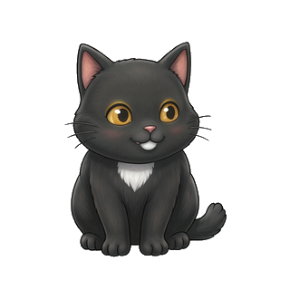

# 小黑桌面宠物 (Xiaohei Desktop Pet)

一只蹲坐在 Windows 桌面上的互动小黑猫。基于 Python + tkinter 分层透明窗口实现，支持拖拽、抚摸、追逐玩具、番茄钟陪伴等多种互动。



## 功能特性

### 基础互动

- **拖拽移动** — 按住猫拖动到任意位置，快速扔出有重力下落和落地缓冲
- **抚摸反应** — 鼠标停在猫身上，猫会眯眼享受，持续抚摸加好感度
- **双击互动** — 双击猫会受惊小跳，播放猫叫
- **悬停挥手** — 鼠标停在猫身上 0.8 秒，猫举右爪打招呼
- **右键菜单** — 所有功能通过右键菜单访问

### 玩具系统

| 玩具 | 说明 |
|------|------|
| **激光笔** | 红点全局跟随鼠标，猫追逐扑击 |
| **逗猫棒** | 粉紫蓝渐变羽毛逗猫棒跟随光标带摆动，猫扑到时逗猫棒会跳开 |
| **毛线球** | 右键放出红色毛线球，物理滚动+旋转，猫追着拨球 |
| **小老鼠** | 右键放出灰色小老鼠，自主闲逛/逃跑/躲藏，猫蹲伏蓄力扑击 |

### 喂养系统

- **喂鱼** — 右键喂鱼，橙白锦鲤从上方落下，猫跑过去吃，好感度 +5
- **每日上限** — 每天最多喂 5 条，吃 3 条后进入饱腹状态
- **饱腹机制** — 饱腹时猫会拒绝再吃，说「吃不下啦」

### 番茄钟助手

- **专注模式** — 25 分钟专注，猫安静蹲着不扑光标、不换动作，陪你工作
- **休息模式** — 5 分钟休息，猫恢复正常玩耍
- **自动循环** — 到点自动切换，专注完成有爱心粒子庆祝和猫叫
- **周期计数** — 记录完成的番茄钟数量

### 环境互动

- **窗口栖息** — 右键「去窗口休息」，猫跳到当前前台窗口标题栏上蹲着
- **行为状态机** — 坐姿、左右张望、眨眼、舔毛、伸懒腰、打哈欠、舔爪、拨球，8 种行为自动切换
- **物理引擎** — 重力、终端速度、拖拽释放速度检测、落地反弹

### 成长系统

- **好感度等级** — 0-5 级（陌生→熟悉→朋友→好友→亲密→挚友），每 50 点一级
- **升级提示** — 升级时猫跳出来庆祝，说「好感度提升！」
- **统计持久化** — 好感度、喂食次数等保存在 stats.json

### 音效系统

- **10 个真实猫叫** — 8 个 Mixkit 真实猫叫录音 + 落地声 + 扑击声
- **场景对应** — 抚摸/拖拽/双击/唤醒/扑击/喂食各有对应音效
- **可开关** — 右键切换音效开关

## 运行方式

### 源码运行

需要 Python 3.10+：

```bash
pip install Pillow
python pet.py
```

或双击 `start.bat`。

### 打包 exe

```bash
pip install pyinstaller
build.bat
```

产物在 `dist/XiaoheiPet/`，双击 `XiaoheiPet.exe` 即可运行，无需 Python。

## 项目结构

```
pet.py                  主程序（分层窗口 + 行为状态机 + 物理引擎 + 所有互动）
pet_ctl.py              状态桥 CLI（外部程序写入 status.json）
soundsynth.py           land/pounce 音效合成脚本
gen_frames_from_sit.py  从坐姿帧生成其他动画帧
start.bat               启动脚本
build.bat               PyInstaller 打包脚本
assets/
  frames/               7 帧精灵 + 4 个玩具精灵
    frame_0_sit.png     坐姿
    frame_1_blink.png   眨眼/睡觉
    frame_2_yawn.png    打哈欠
    frame_3_groom.png   舔毛
    frame_4_stretch.png 伸懒腰
    frame_5_wave.png    挥手
    frame_6_paw.png     伸爪拨球
    fish.png            鱼（80x80）
    yarn.png            毛线球（64x64）
    mouse.png           老鼠（64x64）
    wand.png            逗猫棒（80x80）
  sounds/               10 个 wav 音效
```

## 运行时数据

保存在 `%USERPROFILE%\.workbuddy\pet\`：

| 文件 | 说明 |
|------|------|
| `status.json` | 当前状态（可被外部程序写入） |
| `position.json` | 窗口位置记忆 |
| `prefs.json` | 用户偏好（音效开关等） |
| `stats.json` | 好感度、喂食次数等统计 |
| `pet.log` | 运行日志 |

## 技术栈

- **Python + tkinter** — 分层透明窗口（WS_EX_LAYERED + UpdateLayeredWindow）
- **Pillow** — 图像合成、帧缩放、旋转、透明背景处理
- **ctypes Win32 API** — 窗口枚举、前台窗口检测、DPI 感知、窗口置顶
- **winsound** — 音效播放
- **纯标准库 + Pillow** — 无其他第三方依赖

## 高 DPI 适配

- 自动检测系统 DPI 缩放（200% 缩放下逻辑坐标 1440x960）
- 所有窗口坐标使用物理像素，避免缩放模糊
- 精灵图按 DPI 比例缩放渲染

## 许可

MIT License
